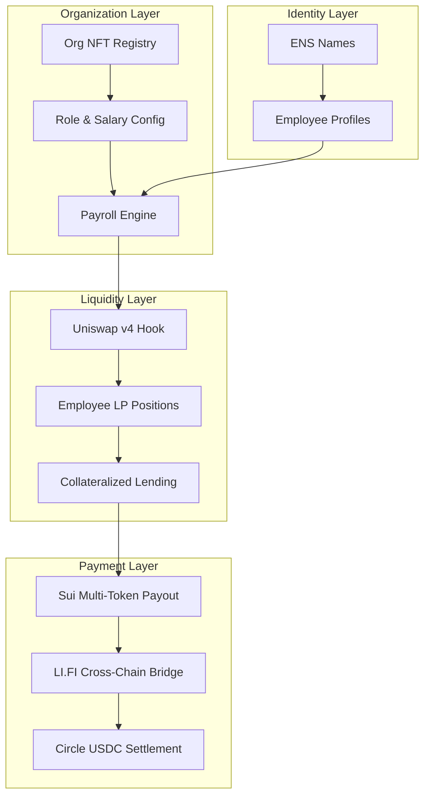
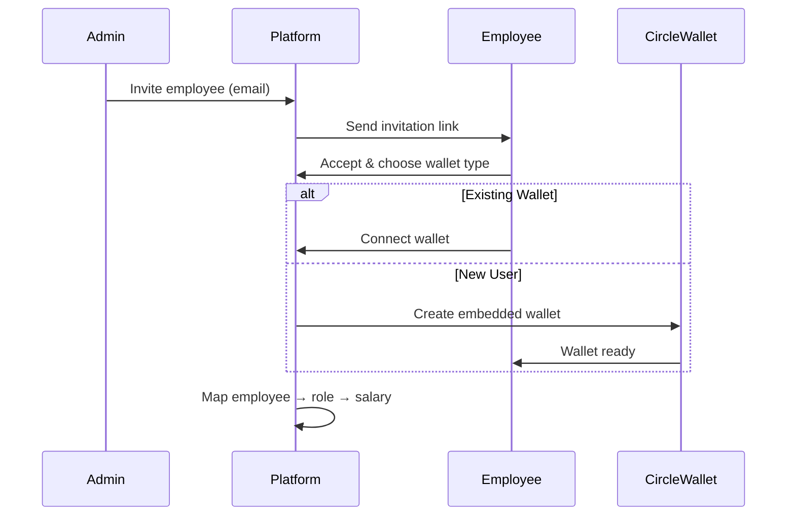
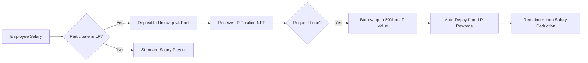
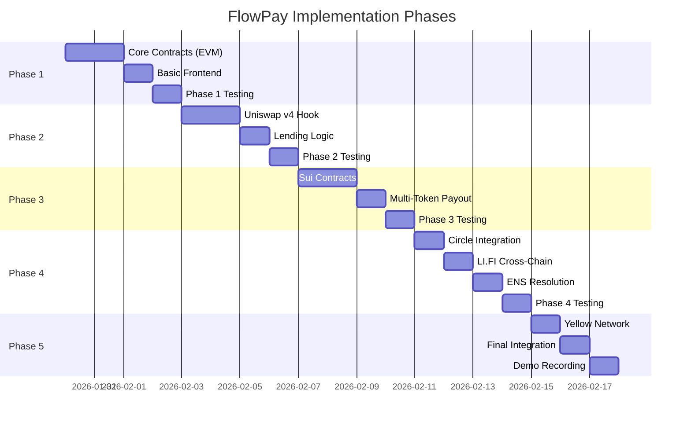

# FlowPay: Payment Streaming & Liquidity-Backed Lending Platform

## Product Requirements Document (PRD)

> **Version:** 1.0  
> **Status:** Draft  
> **Target Event:** HackMoney 2026 (ETHGlobal)

---

## Table of Contents

1. [Executive Summary](#1-executive-summary)
2. [Problem Statement](#2-problem-statement)
3. [Solution Overview](#3-solution-overview)
4. [Prize Integration Strategy](#4-prize-integration-strategy)
5. [Core Features](#5-core-features)
6. [Technical Architecture](#6-technical-architecture)
7. [Phased Implementation Plan](#7-phased-implementation-plan)
8. [Testing Strategy](#8-testing-strategy)
9. [Success Metrics](#9-success-metrics)
10. [Open Questions & Risks](#10-open-questions--risks)

---

## 1. Executive Summary

**FlowPay** is a next-generation payment infrastructure platform that enables:

- **Automated payroll** via rule-based NFT configurations
- **Salary streaming** with real-time accrual and multi-token payouts
- **Liquidity-backed lending** where employees provide LP to Uniswap v4 pools and receive loans against their positions
- **Cross-chain payroll** execution across EVM chains and Sui
- **Privacy-preserving** loan mechanics invisible to employers

### Key Differentiators

| Feature | Traditional | FlowPay |
|---------|-------------|---------|
| Payroll Execution | Manual, multi-step | Single confirmation |
| Salary Advances | Risky, opaque | On-chain, private loans |
| Multi-Chain Support | None | Native via LI.FI + Sui |
| Employee Benefits | Limited | LP rewards + lending |

---

## 2. Problem Statement

### For Organizations

- Complex, manual payroll execution requiring multiple systems
- Fragmented HR, payroll, banking, and lending integrations
- No transparent way to offer salary advances without risk
- Difficulty paying international remote workers in preferred currencies

### For Employees

- Delayed or opaque salary payments
- Limited access to fair, income-backed loans
- Employer visibility into personal financial stress
- Fixed payout currency regardless of preference

---

## 3. Solution Overview

FlowPay addresses these problems through an integrated platform built on:



---

## 4. Prize Integration Strategy

### Target Prizes: $56,000 Total

| Sponsor | Prize Pool | Integration Focus | Priority |
|---------|-----------|-------------------|----------|
| **Yellow Network** | $15,000 | Nitrolite SDK for instant off-chain payments | High |
| **Uniswap Foundation** | $10,000 | v4 Hooks for LP-backed lending | **Core** |
| **Sui** | $10,000 | Multi-token payouts + PTBs | **Core** |
| **Arc/Circle** | $10,000 | USDC settlement + Circle Wallets | **Core** |
| **LI.FI** | $6,000 | Cross-chain payroll execution | Medium |
| **ENS** | $5,000 | Identity resolution for payees | Medium |

---

### 4.1 Uniswap Foundation Integration ($10K)

> **Core Feature: LP-Backed Employee Lending**

**Hook Functionality:**
- Custom Uniswap v4 hook enabling employees to provide liquidity to designated pools
- LP positions serve as collateral for salary advances
- Automatic loan repayment from LP rewards and salary deductions

**Technical Requirements:**
- Deploy custom hook using [v4-template](https://github.com/uniswapfoundation/v4-template)
- Integrate with OpenZeppelin v4 Hooks Library
- Testnet transactions required (Sepolia or Base Sepolia)

**Employee Flow:**
1. Employee deposits idle salary into USDC/ETH pool via hook
2. Hook mints position NFT tracking employee's share
3. Employee can borrow up to 50% of LP value
4. Loan auto-repays from:
   - LP fee accrual
   - Next salary cycle deduction (if needed)

---

### 4.2 Sui Integration ($10K)

> **Core Feature: Multi-Token Payouts**

**Capabilities:**
- Use Programmable Transaction Blocks (PTBs) for atomic multi-recipient payouts
- Native multi-token support (SUI, USDC, custom tokens)
- DeepBook integration for on-chain token swaps if employees request currency conversion

**Technical Requirements:**
- Build on Sui with Sui-specific capabilities
- Working prototype demonstrating Sui's advantages
- Clear problem/solution articulation

**Implementation:**
```move
// Batch payout with automatic token conversion
public fun execute_payroll(
    org: &Organization,
    recipients: vector<address>,
    amounts: vector<u64>,
    tokens: vector<TypeName>,
    deepbook: &mut DeepBook
) {
    // Atomic multi-token payout via PTB
}
```

---

### 4.3 Arc/Circle Integration ($10K)

> **Core Feature: USDC Settlement & Wallets**

**Integration Points:**
- **Circle Wallets**: Embedded wallets for employees without crypto experience
- **Circle Gateway**: Fiat on/off-ramp for organizations
- **USDC**: Primary settlement currency across all chains
- **Arc Network**: Fast finality for payroll transactions

**Technical Requirements:**
- Circle Developer account required
- Functional MVP with frontend/backend
- Architecture diagram
- Demo video demonstrating Circle tool usage

---

### 4.4 Yellow Network Integration ($15K)

> **Feature: Instant Off-Chain Payments**

**Use Case:** Real-time salary streaming without on-chain gas costs

**Technical Requirements:**
- Integrate Nitrolite SDK
- Demonstrate off-chain transaction logic
- Show session-based spending or instant payments
- Final settlement via smart contracts

**Implementation Approach:**
- Salary accrues in Yellow payment channels
- Employees can claim instantly (off-chain)
- Settlement happens in batches (on-chain)

---

### 4.5 LI.FI Integration ($6K)

> **Feature: Cross-Chain Payroll Execution**

**Use Case:** Pay employees on their preferred chain

**Technical Requirements:**
- Use LI.FI SDK/API for cross-chain actions
- Support at least 2 EVM chains
- Working frontend with swap/bridge functionality

**Implementation:**
- Employer funds payroll in USDC on Base
- LI.FI bridges to employee's preferred chain (Arbitrum, Polygon, etc.)
- Automatic conversion to preferred token if needed

---

### 4.6 ENS Integration ($5K)

> **Feature: Human-Readable Payment Addresses**

**Use Case:** Pay employees via ENS names instead of addresses

**Technical Requirements:**
- Meaningful ENS integration (not just Rainbowkit)
- Custom wagmi hooks for ENS resolution
- No hard-coded values

**Implementation:**
- Employee profiles linked to ENS names
- Payroll execution accepts `alice.eth` as recipient
- Organization registry supports ENS for admin identification

---

## 5. Core Features

### 5.1 Organization Management

| Feature | Description | Smart Contract |
|---------|-------------|----------------|
| Org NFT | One NFT per organization with role/salary config | `OrgRegistry.sol` |
| Role Definition | Define roles with associated salary bands | Embedded in NFT |
| Approval Flow | Multi-sig payroll approval | `PayrollApproval.sol` |
| Version History | Immutable audit trail | Event logs |

---

### 5.2 Employee Onboarding



---

### 5.3 Payroll Engine

**Calculation Flow:**
1. Fetch headcount per role from on-chain registry
2. Calculate total payroll off-chain
3. Generate Merkle root for batch payout
4. Submit to payroll contract for approval
5. Execute after multi-sig confirmation

**Payment Options:**
- One-time payments
- Recurring scheduled payments
- Continuous streaming (Yellow Network)

---

### 5.4 LP-Backed Lending (Uniswap v4 Hook)



**Loan Parameters:**
- Max LTV: 50% of LP position value
- Max Duration: 6 months
- Interest: LP fee share (2-5% APY equivalent)
- Privacy: Employer sees only aggregate deductions

---

### 5.5 Multi-Token Payout (Sui)

**Supported Payout Modes:**

| Mode | Description | Gas Efficiency |
|------|-------------|----------------|
| Single Token | All employees in same token | High |
| Per-Employee Choice | Each employee selects preferred token | Medium |
| Auto-Convert | On-chain swap via DeepBook | Lower |

---

### 5.6 Cross-Chain Execution (LI.FI)

**Supported Chains:**
- Base (primary)
- Arbitrum
- Polygon
- Optimism
- (Sui via separate flow)

**Bridge Strategy:**
- Aggregate payroll on Base
- Batch bridge transactions per destination chain
- LI.FI handles optimal routing

---

## 6. Technical Architecture

### 6.1 System Layers

```
┌─────────────────────────────────────────────────────────────┐
│                    CLIENT LAYER                              │
│  ┌─────────────┐  ┌─────────────┐  ┌─────────────────────┐  │
│  │  Web App    │  │ Mobile App  │  │  Circle Embedded    │  │
│  │  (Next.js)  │  │ (React Native)│ │  Wallet SDK         │  │
│  └─────────────┘  └─────────────┘  └─────────────────────┘  │
└─────────────────────────────────────────────────────────────┘
                              │
┌─────────────────────────────────────────────────────────────┐
│                 ORCHESTRATION LAYER                          │
│  ┌─────────────┐  ┌─────────────┐  ┌─────────────────────┐  │
│  │ Auth Service│  │ Payroll     │  │   Yellow Channel    │  │
│  │             │  │ Orchestrator│  │   Manager           │  │
│  └─────────────┘  └─────────────┘  └─────────────────────┘  │
│  ┌─────────────┐  ┌─────────────┐  ┌─────────────────────┐  │
│  │ LI.FI       │  │ Notification│  │   ENS Resolver      │  │
│  │ Aggregator  │  │ Service     │  │   Service           │  │
│  └─────────────┘  └─────────────┘  └─────────────────────┘  │
└─────────────────────────────────────────────────────────────┘
                              │
┌─────────────────────────────────────────────────────────────┐
│                 SMART CONTRACT LAYER                         │
│                                                               │
│  ┌─── EVM (Base/Sepolia) ───┐    ┌─── Sui Network ────────┐ │
│  │                           │    │                         │ │
│  │  ┌─────────────────────┐ │    │  ┌───────────────────┐  │ │
│  │  │  OrgRegistry.sol    │ │    │  │  payroll.move     │  │ │
│  │  │  (NFT-based org)    │ │    │  │  (Multi-token)    │  │ │
│  │  └─────────────────────┘ │    │  └───────────────────┘  │ │
│  │  ┌─────────────────────┐ │    │  ┌───────────────────┐  │ │
│  │  │  PayrollHook.sol    │ │    │  │  lending.move     │  │ │
│  │  │  (Uniswap v4)       │ │    │  │  (LP-backed)      │  │ │
│  │  └─────────────────────┘ │    │  └───────────────────┘  │ │
│  │  ┌─────────────────────┐ │    │                         │ │
│  │  │  LendingPool.sol    │ │    │                         │ │
│  │  │  (Collateral mgmt)  │ │    │                         │ │
│  │  └─────────────────────┘ │    │                         │ │
│  └───────────────────────────┘    └─────────────────────────┘ │
└─────────────────────────────────────────────────────────────┘
```

### 6.2 Contract Addresses (Placeholder)

| Contract | Network | Address |
|----------|---------|---------|
| OrgRegistry | Base Sepolia | TBD |
| PayrollHook | Base Sepolia | TBD |
| LendingPool | Base Sepolia | TBD |
| Payroll Module | Sui Testnet | TBD |

---

## 7. Phased Implementation Plan

### Overview



---

### Phase 1: Foundation (Days 1-2)

#### Objectives
- Deploy core organization and payroll contracts
- Establish basic frontend with wallet connection
- Validate end-to-end payroll flow

#### Sub-phases

##### 1.1 Smart Contract Foundation
**Deliverables:**
- `OrgRegistry.sol` - NFT-based organization management
- `Payroll.sol` - Basic batch payout functionality
- `RoleManager.sol` - Role and salary configuration

**Testing Checkpoint:**
- [ ] Deploy to Base Sepolia
- [ ] Create test organization
- [ ] Execute single payroll transaction
- [ ] Verify recipient received funds

##### 1.2 Frontend Foundation
**Deliverables:**
- Next.js project setup with TypeScript
- Wallet connection (wagmi + RainbowKit)
- Organization dashboard skeleton
- Employee view skeleton

**Testing Checkpoint:**
- [ ] Connect wallet successfully
- [ ] Display organization details from contract
- [ ] Show employee's salary information

##### 1.3 Phase 1 Integration Test
**End-to-End Test:**
1. Admin creates organization via frontend
2. Admin adds 3 test employees with different roles
3. System calculates total payroll
4. Admin approves and executes payroll
5. Verify all employees received correct amounts

**Exit Criteria:**
- ✅ Basic payroll works on testnet
- ✅ Frontend displays real contract data
- ✅ Transaction hashes captured for submission

---

### Phase 2: Uniswap v4 Hook & Lending (Days 3-4)

#### Objectives
- Implement custom Uniswap v4 hook for LP positions
- Enable LP-backed lending for employees
- Automatic loan repayment from LP rewards

#### Sub-phases

##### 2.1 Uniswap v4 Hook Development
**Deliverables:**
- `PayrollHook.sol` inheriting from BaseHook
- Position tracking for employee LP deposits
- Integration with Uniswap v4 PoolManager

**Key Functions:**
```solidity
// Hook permissions
function getHookPermissions() public pure override returns (Hooks.Permissions memory);

// Track employee deposits
function afterAddLiquidity(
    address sender,
    PoolKey calldata key,
    IPoolManager.ModifyLiquidityParams calldata params,
    BalanceDelta delta,
    bytes calldata hookData
) external returns (bytes4, BalanceDelta);

// Handle loan collateralization
function beforeRemoveLiquidity(/* ... */) external returns (bytes4);
```

**Testing Checkpoint:**
- [ ] Hook deploys successfully
- [ ] Employee can deposit to pool via hook
- [ ] Position NFT minted correctly
- [ ] Collateral value tracked accurately

##### 2.2 Lending Logic Implementation
**Deliverables:**
- `LendingPool.sol` integrated with hook
- Loan origination based on LP value
- Repayment tracking and auto-execution

**Loan Parameters:**
| Parameter | Value |
|-----------|-------|
| Max LTV | 50% |
| Duration | 1-6 months |
| Rate | LP fee equivalent |
| Privacy | Employee-only visibility |

**Testing Checkpoint:**
- [ ] Employee can request loan against LP
- [ ] Loan amount <= 50% of LP value enforced
- [ ] Loan repayment from LP rewards works
- [ ] Outstanding balance reflected in payroll deductions

##### 2.3 Phase 2 Integration Test
**End-to-End Test:**
1. Employee deposits $1000 USDC to LP pool
2. Employee requests $400 loan (40% LTV)
3. System disburses loan immediately
4. LP generates $10 in fees over test period
5. Verify $10 applied to loan balance
6. Run payroll with remaining $390 deducted
7. Confirm loan closed after full repayment

**Exit Criteria:**
- ✅ Hook transactions on testnet (required for prize)
- ✅ LP-backed loans functional
- ✅ Privacy maintained (employer can't see loan details)

---

### Phase 3: Sui Multi-Token Payout (Days 5-6)

#### Objectives
- Deploy Sui Move contracts for payroll
- Enable multi-token payouts via PTBs
- Integrate DeepBook for optional token conversion

#### Sub-phases

##### 3.1 Sui Contract Development
**Deliverables:**
- `payroll.move` - Core payroll module
- `organization.move` - Org registry on Sui
- `token_preferences.move` - Employee token choices

**Move Module Structure:**
```move
module flowpay::payroll {
    use sui::coin::{Self, Coin};
    use sui::transfer;
    use std::vector;
    
    public entry fun batch_payout(
        treasury: &mut Treasury,
        recipients: vector<address>,
        amounts: vector<u64>,
        ctx: &mut TxContext
    ) {
        // Atomic multi-recipient payout
    }
}
```

**Testing Checkpoint:**
- [ ] Deploy to Sui Testnet
- [ ] Create organization object
- [ ] Execute batch payout to 5+ recipients
- [ ] Verify PTB atomicity (all or nothing)

##### 3.2 Multi-Token Payout Logic
**Deliverables:**
- Support for SUI, USDC, and USDT payouts
- Per-employee token preference storage
- Mixed-token batch transactions

**Testing Checkpoint:**
- [ ] Payout to different employees in different tokens
- [ ] Token preferences saved and respected
- [ ] Gas costs optimized for batch operations

##### 3.3 DeepBook Integration (Optional Enhancement)
**Deliverables:**
- On-chain swap via DeepBook if needed
- Fallback to direct transfer if swap unavailable

**Testing Checkpoint:**
- [ ] Employee requests payout in token X
- [ ] If treasury holds token Y, swap via DeepBook
- [ ] Net payout matches expected after slippage

##### 3.4 Phase 3 Integration Test
**End-to-End Test:**
1. Organization treasury holds 10,000 SUI
2. Configure 3 employees: prefers SUI, 2 prefer USDC
3. Execute payroll via PTB
4. Verify:
   - Employee 1 receives SUI directly
   - Employees 2 & 3 receive USDC (via DeepBook swap)
   - Single transaction hash for all

**Exit Criteria:**
- ✅ Working prototype on Sui
- ✅ Demonstrates Sui-specific capabilities (PTBs, DeepBook)
- ✅ Clear narrative on why Sui is well-suited

---

### Phase 4: Circle, LI.FI, ENS Integration (Day 7)

#### Objectives
- Add Circle Wallet support for new users
- Enable cross-chain payroll via LI.FI
- Implement ENS-based payment addressing

#### Sub-phases

##### 4.1 Circle Integration
**Deliverables:**
- Circle Wallet SDK integration
- Embedded wallet creation for new employees
- USDC as primary settlement currency

**Arc Tools Required:**
- [ ] Circle Gateway (fiat on-ramp)
- [ ] Circle Wallets (embedded)
- [ ] USDC support

**Testing Checkpoint:**
- [ ] New user signup creates Circle wallet
- [ ] User can view USDC balance
- [ ] Payout to Circle wallet succeeds

##### 4.2 LI.FI Cross-Chain
**Deliverables:**
- LI.FI SDK integration for bridging
- Support for payroll on Base → Arbitrum/Polygon
- Frontend chain selection for employees

**Supported Flow:**
```
Employer (Base USDC) → LI.FI → Employee (Arbitrum ETH)
                            → Employee (Polygon MATIC)
```

**Testing Checkpoint:**
- [ ] Bridge quote retrieval works
- [ ] Execute cross-chain payout
- [ ] Monitor for completion via LI.FI status API

##### 4.3 ENS Resolution
**Deliverables:**
- Custom wagmi hooks for ENS lookups
- Accept ENS names in recipient fields
- Display resolved addresses with visual confirmation

**Implementation:**
```typescript
// Custom hook (not just Rainbowkit default)
const useENSPayee = (ensName: string) => {
  const { data: address } = useEnsAddress({ name: ensName });
  const { data: avatar } = useEnsAvatar({ name: ensName });
  return { address, avatar, isValid: !!address };
};
```

**Testing Checkpoint:**
- [ ] Enter `alice.eth` in payee field
- [ ] Resolves to correct address
- [ ] Payout executes to resolved address

##### 4.4 Phase 4 Integration Test
**End-to-End Test:**
1. New employee signs up (gets Circle wallet)
2. Admin adds employee using ENS name
3. Configure employee for Polygon chain preference
4. Execute payroll
5. Verify:
   - ENS resolved correctly
   - Funds bridged via LI.FI
   - Employee received on Polygon

**Exit Criteria:**
- ✅ Circle tools demonstrably used
- ✅ 2+ EVM chains supported via LI.FI
- ✅ ENS integration is meaningful (not afterthought)

---

### Phase 5: Yellow Network & Polish (Day 8)

#### Objectives
- Integrate Yellow Network for instant off-chain payments
- Final integration and polish
- Record demo video

#### Sub-phases

##### 5.1 Yellow Network Integration
**Deliverables:**
- Nitrolite SDK integration
- Payment channel for salary streaming
- On-chain settlement for batch finalization

**Off-Chain Flow:**
```
Salary Accrual (Yellow Channel)
    ↓
Employee views balance (instant, gas-free)
    ↓
Employee claims (off-chain instant)
    ↓
Batch settlement (on-chain, periodic)
```

**Testing Checkpoint:**
- [ ] Create payment channel for org
- [ ] Stream salary accumulation
- [ ] Instant off-chain claim works
- [ ] Settlement finalizes on-chain

##### 5.2 Final Integration Testing
**Full System Test:**
1. Create organization (Base)
2. Onboard 5 employees:
   - 2 with existing wallets
   - 2 with Circle wallets
   - 1 with ENS name
3. Configure payroll:
   - 2 employees: LP-backed (Uniswap hook)
   - 2 employees: Sui payout
   - 1 employee: Cross-chain (Polygon)
4. Employee 1 takes loan against LP
5. Execute payroll via Yellow (instant)
6. Verify all payouts complete
7. Settle Yellow batch on-chain

##### 5.3 Demo Recording
**Required Videos:**
- 3-minute main demo (all integrations)
- Quick start guide

**Demo Script:**
1. (0:00-0:30) Problem statement + solution overview
2. (0:30-1:00) Organization creation + employee onboard
3. (1:00-1:30) LP deposit + loan request (Uniswap)
4. (1:30-2:00) Multi-token payout execution (Sui)
5. (2:00-2:30) Cross-chain payout (LI.FI)
6. (2:30-3:00) Instant streaming payout (Yellow)

**Exit Criteria:**
- ✅ Demo video recorded
- ✅ All prize requirements met
- ✅ README complete with setup instructions

---

## 8. Testing Strategy

### 8.1 Test Categories

| Category | Tools | Coverage |
|----------|-------|----------|
| Unit Tests | Foundry (Solidity), Move Test | Core logic |
| Integration | Hardhat + local fork | Contract interactions |
| E2E | Playwright + testnet | Full user flows |
| Manual | Browser testing | UX validation |

### 8.2 Per-Phase Testing

#### Phase 1 Tests
```bash
# Contract tests
forge test --match-contract OrgRegistryTest
forge test --match-contract PayrollTest

# Frontend tests
npm run test:e2e -- --grep "payroll basic flow"
```

#### Phase 2 Tests
```bash
# Hook tests (requires v4-template setup)
forge test --match-contract PayrollHookTest

# Lending tests
forge test --match-contract LendingPoolTest

# Integration
forge test --match-contract IntegrationTest
```

#### Phase 3 Tests
```bash
# Sui tests
sui move test

# PTB simulation
sui client ptb --dry-run --move-call flowpay::payroll::batch_payout ...
```

#### Phase 4 Tests
```bash
# LI.FI integration
npm run test:lifi

# ENS resolution
npm run test:ens

# Circle wallet flow
npm run test:circle
```

---

### 8.3 Testnet Deployments

| Phase | Network | Purpose |
|-------|---------|---------|
| 1-2 | Base Sepolia | Core + Uniswap |
| 3 | Sui Testnet | Multi-token |
| 4 | Base + Arbitrum Sepolia | Cross-chain |
| 5 | All above | Integration |

### 8.4 Test Accounts

```
Organization Admin: [Create new wallet]
Employee 1 (LP): [Create new wallet]  
Employee 2 (Sui): [Create new wallet]
Employee 3 (Cross-chain): [Create new wallet]
Employee 4 (ENS): use existing ENS name on testnet
Employee 5 (Circle): create via Circle SDK
```

---

## 9. Success Metrics

### 9.1 Prize Qualification

| Prize | Requirement | How We Meet It |
|-------|-------------|----------------|
| Yellow ($15K) | Nitrolite SDK + off-chain demo | Salary streaming channels |
| Uniswap ($10K) | v4 Hook + testnet tx | LP-backed lending hook |
| Sui ($10K) | Working prototype + Sui capabilities | PTB multi-token payout |
| Arc ($10K) | Circle tools + MVP | Embedded wallets + USDC |
| LI.FI ($6K) | SDK + 2 chains + frontend | Cross-chain payroll |
| ENS ($5K) | Meaningful integration | Payment addressing |

### 9.2 Demo Requirements

- [ ] 2-3 minute video (Yellow)
- [ ] Max 3 minute video (Uniswap)
- [ ] Working prototype (Sui)
- [ ] Architecture diagram (Circle)
- [ ] GitHub repository (All)
- [ ] README with setup (All)

---

## 10. Open Questions & Risks

### 10.1 Technical Risks

| Risk | Mitigation |
|------|------------|
| Uniswap v4 still in development | Use mainnet-ready testnets |
| Cross-chain timing issues | Implement status monitoring |
| Yellow SDK learning curve | Prioritize early in timeline |
| Sui Move complexity | Start with simple examples |

### 10.2 Product Questions

1. **Jurisdiction compliance** - How to handle labor laws across regions?
2. **Default handling** - What if employee leaves with outstanding loan?
3. **LP impermanent loss** - How to communicate risks to employees?
4. **Multi-org employees** - How to handle contractors with multiple clients?

### 10.3 Prize Clarifications Needed

- [ ] Confirm Yellow Network testnet availability
- [ ] Verify Uniswap v4 deployment chain requirements
- [ ] Check Circle sandbox vs. production for hackathon

---

## Appendix A: Resource Links

### Documentation
- [Uniswap v4 Docs](https://docs.uniswap.org/contracts/v4/overview)
- [OpenZeppelin v4 Hooks](https://docs.openzeppelin.com/uniswap-hooks)
- [Sui Developer Guide](https://docs.sui.io/guides/developer/getting-started)
- [DeepBook Docs](https://docs.sui.io/standards/deepbook)
- [Circle Developer Portal](https://developers.circle.com)
- [LI.FI SDK](https://docs.li.fi/sdk/overview)
- [ENS Documentation](https://docs.ens.domains)
- [Yellow Network Docs](https://docs.yellow.org/docs/learn)

### Templates & Examples
- [Uniswap v4 Template](https://github.com/uniswapfoundation/v4-template)
- [LI.FI E2E Example](https://docs.li.fi/introduction/user-flows-and-examples/end-to-end-example)
- [DeepBook Repository](https://github.com/MystenLabs/deepbookv3)

### Faucets
- [Circle Faucet](https://faucet.circle.com/)
- [Base Sepolia](https://www.coinbase.com/faucets/base-sepolia-faucet)
- [Sui Testnet](https://docs.sui.io/guides/developer/getting-started#request-testnet-sui-tokens)

---

## Appendix B: Contract Interface Specifications

### OrgRegistry.sol
```solidity
interface IOrgRegistry {
    struct Organization {
        uint256 id;
        address admin;
        string name;
        Role[] roles;
        address treasury;
    }
    
    struct Role {
        string name;
        uint256 salaryPerPeriod;
        uint256 periodDuration;
    }
    
    function createOrganization(string memory name, Role[] memory roles) external returns (uint256);
    function addEmployee(uint256 orgId, address employee, uint256 roleIndex) external;
    function executePayroll(uint256 orgId, bytes32 merkleRoot) external;
}
```

### PayrollHook.sol
```solidity
interface IPayrollHook {
    struct EmployeePosition {
        address employee;
        uint128 liquidity;
        uint256 depositTimestamp;
        uint256 loanBalance;
    }
    
    function depositAndProvide(PoolKey calldata key, uint256 amount) external;
    function requestLoan(uint256 amount) external;
    function getPositionValue(address employee) external view returns (uint256);
}
```

---

*Document maintained for HackMoney 2026. Last updated: 2026-01-30.*
